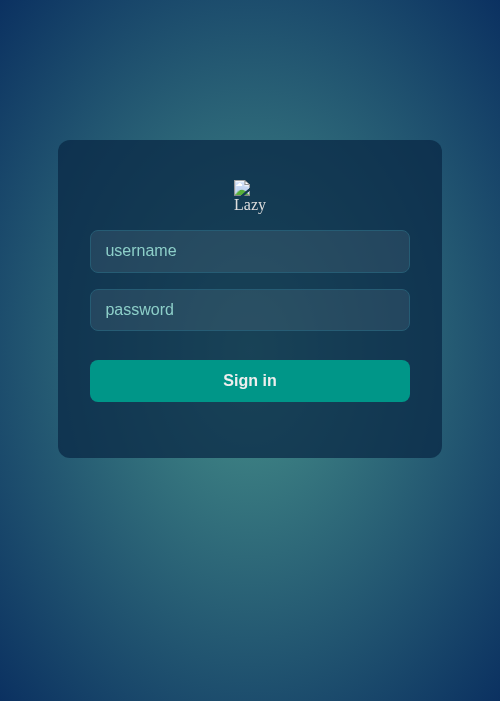
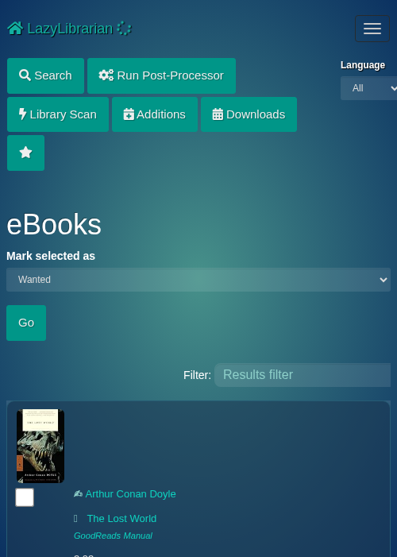
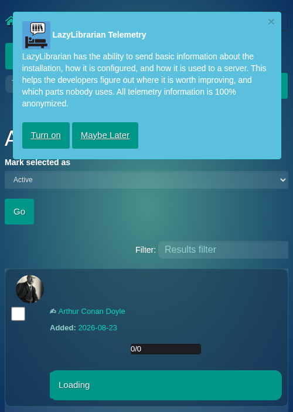
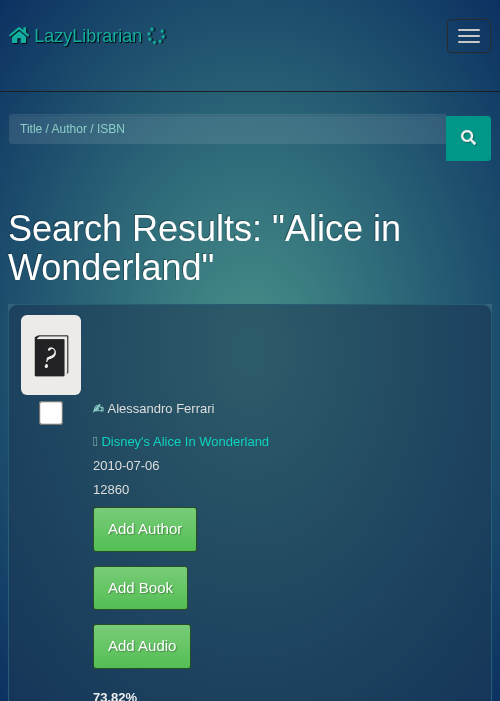
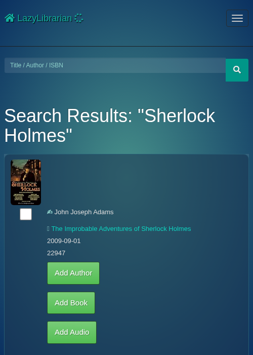

# LazyLibrarian PWA

A thin installable-PWA layer for [LazyLibrarian](https://lazylibrarian.gitlab.io/)
— turns the web UI into a standalone phone app with a **mobile-first design**,
**permanent login**, and the **aquamarine theme** — all injected by a service
worker at page-load. **Zero changes to LazyLibrarian's code.**

> ⚠️ **AI-GENERATED DISCLAIMER**
> This project was generated with AI assistance. It is provided **as-is, without
> warranty of any kind**. Review the code before using it — especially the service
> worker, which stores your login credentials on-device. You use this at your own
> risk; the author accepts no liability for data loss, security issues, or breakage.

## What it does
- **Standalone installable app**: "Add to Home Screen" opens a full-screen window
  (no browser chrome, no URL bar)
- **Mobile-first design**: the service worker injects CSS that turns LL's desktop
  tables into phone-friendly stacked cards (cover left, details right) — only
  applies below 768px, desktop stays untouched
- **Aquamarine theme**: injects the theme.park aquamarine palette
  (lazylibrarian-base + aquamarine CSS)
- **Tap-to-change status**: tap a book's status badge (Skipped/Wanted) on mobile
  → quick menu (Wanted / Open / Ignored / Skipped) → updates via LL's API
- **Rows-per-page selector moved to the bottom** + default 20 rows
- **Permanent login**: credentials stored on-device by the service worker →
  auto-fills the login form on subsequent launches
- **No LL code changes**: everything is injected at page-load by the SW; works on
  any LazyLibrarian install behind a reverse proxy

## Screenshots (phone viewport, aquamarine theme)

| Login | Books | Authors |
|---|---|---|
|  |  |  |

| Author page | Search results |
|---|---|
|  |  |

## Files
| File | Purpose |
|---|---|
| `index.html` | splash page — registers the service worker, then redirects to `/books` |
| `sw-v5.js` | service worker: injects CSS/JS/manifest into every HTML page |
| `sw.js` | alias/fallback of the same SW (older installs can self-upgrade to v5) |
| `manifest.json` | PWA manifest (name, icons, standalone display, start at `/`) |
| `css/lazylibrarian-base.css` | theme.park base theme (structure) |
| `css/aquamarine.css` | aquamarine color palette |
| `css/injected.css` | mobile-first card layout (media queries, <768px only) |
| `js/injected.js` | interactions: tap-status menu, default-20, length-at-bottom, auto-login, SW self-update |
| `icons/` | 192/512 maskable icons + apple-touch-icon |
| `screenshots/` | phone-viewport captures for this README |

## Installation (no LL edits required)

### 1. Host the files
Serve this directory from **the same origin** as your LazyLibrarian proxy
(service workers require same-origin). The `/` path serves the splash; everything
else proxies to LL.

**Caddy example** (app domain proxies to LL):
```
ll-app.example.com {
	@root path /
	handle @root { root * /srv/ll-pwa; file_server }
	handle /index.html { root * /srv/ll-pwa; file_server }
	handle /manifest.json { root * /srv/ll-pwa; file_server }
	handle /sw.js { root * /srv/ll-pwa; file_server }
	handle /sw-v5.js { root * /srv/ll-pwa; file_server }
	handle /icons/* { root * /srv/ll-pwa; file_server }
	handle /css/* { root * /srv/ll-pwa; file_server }
	handle /js/* { root * /srv/ll-pwa; file_server }
	handle /apple-touch-icon.png { root * /srv/ll-pwa; file_server }
	header { Cache-Control "no-cache" }
	handle { reverse_proxy 192.168.1.10:5299 }
}
```
**Important**: the `Cache-Control: no-cache` header is required — browsers hold
service-worker scripts for ~24h otherwise, delaying updates. For nginx/Apache,
map the same paths to the static dir, proxy everything else to LL, and set
`no-cache` on `sw*.js`/`manifest.json`/`index.html`.

### 2. Install on the phone
1. Open `https://ll-app.example.com` → splash registers the SW → log in (FORM)
2. Browser menu → **Add to Home Screen** → done
3. Reopen from the icon → standalone app, themed, stays logged in

## How the injection works
The service worker intercepts every HTML navigation from LL and:
1. **Injects the CSS chain** (`lazylibrarian-base` → `aquamarine` → `injected`)
   before `</head>`
2. **Injects `injected.js`** before `</body>` (tap-status menu, default-20,
   length-at-bottom, auto-login, SW self-update)
3. **Replaces LL's manifest link** with this PWA's manifest (LL ships a broken
   `images/manifest.json` that breaks standalone mode)
4. **Rewrites the DataTables `dom` string** so the rows-per-page selector sits at
   the bottom

LL itself is never modified — the SW re-serves modified copies of LL's pages.
Upstream LL template changes may require updating the injection patterns (see
`sw-v5.js`).

## Self-update
`injected.js` registers `sw-v5.js` by filename on every page. Because the
filename is versioned, a new SW installs immediately even if the browser is
holding an older one — no manual cache clearing needed when this project updates.

## Security model
- Credentials are stored in the service worker's cache (`/__auth__` entry) — only
  accessible to your browser profile on that device
- **Your phone's lock screen is the security gate**
- Credentials are never sent anywhere except your own LazyLibrarian origin
- To revoke a device: change the LazyLibrarian password (server-side invalidation)

## Requirements
- LazyLibrarian with **FORM auth** enabled (`General > Auth Type: Form`)
- HTTPS (required for service workers)

## Not included
- Offline book reading (data always network-fresh — by design)
- iOS push notifications
- A full UI rewrite — this is the mobile layer; LL's desktop UI is untouched

## License
MIT — use freely, modify, share.
