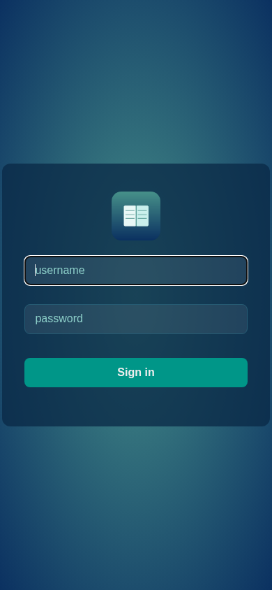

# LazyLibrarian PWA

A thin installable-PWA layer for [LazyLibrarian](https://lazylibrarian.gitlab.io/)
— turns the web UI into a standalone phone app with **permanent login** on
authorized devices. No changes to LazyLibrarian's code.

> ⚠️ **AI-GENERATED DISCLAIMER**
> This project was generated with AI assistance. It is provided **as-is, without
> warranty of any kind**. Review the code before using it — especially the service
> worker, which stores your API key on-device. You use this at your own risk; the
> author accepts no liability for data loss, security issues, or breakage.

## What it does
- **Installable**: served from its own subdomain (or any origin) → "Add to Home
  Screen" gives a standalone app window (no browser chrome)
- **Permanent login**: after first login, the service worker stores the LazyLibrarian
  API key on-device → the app opens straight into your library on subsequent launches
- **Theme-aware**: picks up your existing LazyLibrarian theme (e.g. theme.park)
- **Shell caching**: app shell loads fast / works offline-ish; library data stays
  network-fresh (network-first)

## Screenshot

The themed login page in a phone-sized standalone window (FORM auth, no browser popup).

## Files
| File | Purpose |
|---|---|
| `manifest.json` | PWA manifest (name, icons, standalone display) |
| `sw.js` | service worker: shell cache + API-key persistence |
| `icons/` | 192/512 maskable icons + apple-touch-icon (aquamarine) |

## Installation (3 steps)

### 1. Host the files
Serve `manifest.json`, `sw.js`, `icons/` from **the same origin** as your
LazyLibrarian proxy (service workers require same-origin).

**Caddy example** (app domain proxies to LL):
```
ll-app.example.com {
	handle /manifest.json { root * /srv/ll-pwa; file_server }
	handle /sw.js { root * /srv/ll-pwa; file_server }
	handle /icons/* { root * /srv/ll-pwa; file_server }
	handle /apple-touch-icon.png { root * /srv/ll-pwa; file_server }
	handle { reverse_proxy 192.168.1.10:5299 }
}
```
For nginx/Apache: map the same paths to the static dir, proxy everything else to LL.

### 2. Point LazyLibrarian's pages at the manifest
Edit LL's template `data/interfaces/bookstrap/base.html`:
```html
<!-- replace the existing lines -->
<link rel="apple-touch-icon" href="https://ll-app.example.com/apple-touch-icon.png">
<link rel="manifest" href="https://ll-app.example.com/manifest.json">
```
(In Docker, bind-mount the patched base.html over the container's copy — survives
recreates.)

### 3. Install on the phone
1. Open `https://ll-app.example.com` → log in to LazyLibrarian (FORM login)
2. Browser menu → **Add to Home Screen** → done

## Permanent-login security model
- The API key is stored in the service worker's cache (`/__auth__` entry) — only
  accessible to your browser profile on that device
- **Your phone's lock screen is the security gate**: anyone with the unlocked phone
  can open the app with your credentials
- Keys are never sent anywhere except your own LazyLibrarian origin
- To revoke a device: change the LazyLibrarian API key (server-side invalidation)

## Requirements
- LazyLibrarian with **FORM auth** enabled (`General > Auth Type: Form`) — the
  default BASIC auth shows a browser popup that doesn't work well in standalone mode
- HTTPS (required for service workers)

## Not included
- Offline book reading (data always network-fresh — by design)
- iOS push notifications (not implemented)
- A UI rewrite — this is intentionally just the install + auth layer

## License
MIT — use freely, modify, share.
